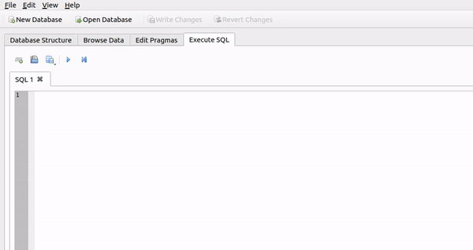
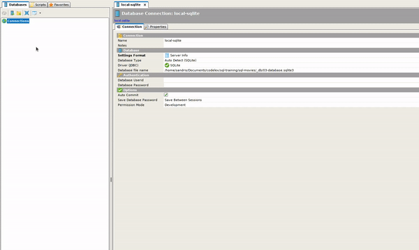
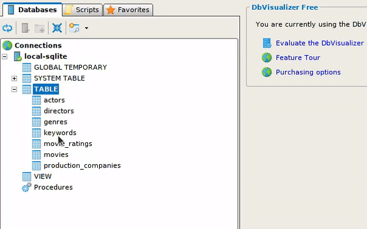
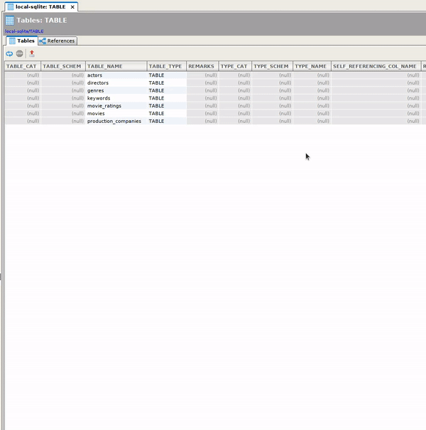

# 📊 SQL Training | [CODELEX](https://codelex.io)

This repository consists of exercises to train your skills on SQL. SQLite was chosen because it is platform agnostic, and stores data in a single file which can be accessed easily.

## Prerequisites

 - basic coding knowledge is preferred, especially string manipulations in JavaScipt / TypeScript;
 - `node` & `npm` installed on your machine
 - understanding the basic concepts of SQL, tutorials [@sqlzoo.net](https://sqlzoo.net/) should be enough

## Getting Ready

### [SQLite Browser](https://sqlitebrowser.org/)

SQLite Browser is a visual tool to help you work with a database.

You can download it [here](https://sqlitebrowser.org/dl/).

Opening database file is as easy as finding it on your file system, file extension is `.sqlite3`

### [DbVisualizer](https://www.dbvis.com/)

DbVisualizer is tool, very similar to SQLite browser, but supports many diferrent databases. We are interested in database visualisation, to better understand tables and relationships between them.

Start by opening your database file.

You will be prompted for:

 - *connection name* - choose whatever name you want
 - *database driver* - choose SQLite
 - *database file* - select your database file from file system

We are interested in database visualisation, to do that open **TABLES** in a new tab.

And click on *References*.

## SQLite

### Resources

 - [Documentation @sqlite.org](https://www.sqlite.org/docs.html)
 - [SQLite @w3resource.com](https://www.w3resource.com/sqlite/index.php)

## Exercises

To start working on exercise, open it as a folder in Visual Studio Code and run `npm install`

### [🎬 SQL Movies](./sql-movies)