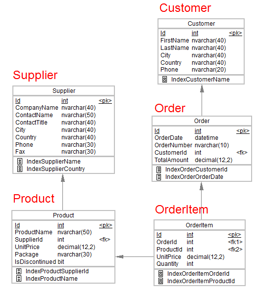

# Vision International LTD

You have newly joined as a Data Engineer for Vision International ltd. You have been tasked with the setup of the database for Vision International ltd. The ER Diagram for the proposed database has already been designed. The data to be entered to the designed tables are provided as an SQL script. Please download the provided ‘data.sql’ file for inserting values into the database. There are few tasks to be executed - check out the problem statement for more details.

## Problem Statement

You have newly joined as a Data Engineer for Vision International ltd. You have been tasked
with the setup of the database for Vision International ltd. The following tasks need to be
executed. The ER Diagram for the proposed database has already been designed. The data
to be entered to the designed tables are provided as an SQL script. Please download the
provided ‘data.sql’ file for inserting values into the database.

### You are required to do the following

1.  Write an SQL script to create the tables and set constraints based on the given ER diagram. Also define the indexes as specified in the ER Diagram.

2.  The company wants to identify suppliers who are responsible for the highest revenue. This data would have to be regularly accessed. Create a view which has the following columns.

| SupplierId | ProductId | Revenue |
| ---------- | --------- | ------- |

3. Write SQL transactions for the following activities:
   a. Adding a new customer to the database.
   b. Updating a new order into the database.

4. Vision International ltd. also intends to send out promotional offers to customers who have placed orders amounting to more than 5000. Identify the names of these customers.

The output table should be:

| Customer Name | No of Orders | Total order Value |
| ------------- | ------------ | ----------------- |

5. Identify those customers who are responsible for at least 10 orders with the 'average order value' being greater than 1000. The output table should contain the following columns:

| Customer Name | No of Orders | Total order value | Average order value |
| ------------- | ------------ | ----------------- | ------------------- |
